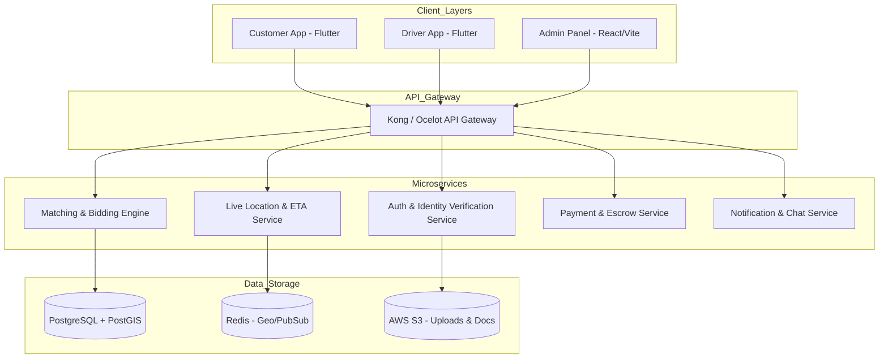

# Martı TAG Modeli Çekici Uygulaması (TAG Çekici) Özellik Yol Haritası

Bu analiz belgesi, Türkiye'deki popüler yolculuk paylaşım platformu **Martı TAG** modelinin tüm işlevsel, operasyonel ve teknik özelliklerini bir **Çekici (Kurtarıcı)** platformuna uyarlayarak detaylandırmaktadır. 

---

## 1. Kullanıcı ve Çekici (Sürücü) Doğrulama & Onboarding
Martı TAG'ın en kritik başarı faktörlerinden biri olan güvenlik ve yasal uyumluluk adımlarının çekici sektörüne uyarlanmasıdır.

### A. Müşteri (Yolcu) Tarafı Doğrulama
*   **T.C. Kimlik No & Nüfus Müdürlüğü (KPS) Entegrasyonu:** Kayıt esnasında ad, soyad, doğum yılı ve T.C. Kimlik Numarasının e-Devlet/MERNIS üzerinden anlık doğrulanması.
*   **Kredi Kartı Eşleşmesi (Iyzico/Lidio):** Hesap sahibinin ismiyle, ödeme yapılacak kart üzerindeki ismin 3D Secure/Tokenization yöntemiyle doğrulanması (Sahte hesap engelleme).
*   **Selfie Tabanlı Biyometrik Doğrulama:** Şüpheli durumlarda veya ilk çağrıda, kullanıcının canlı selfie çekerek T.C. Kimlik kartındaki fotoğrafla eşleştirilmesi.

### B. Çekici Sürücüsü (TAG Sürücüsü) Tarafı Doğrulama
*   **Kapsamlı Evrak Tarama ve OCR:**
    *   Sürücü Belgesi (Ehliyet - Sınıf kontrolü: C, CE vb. çekici sınıfı uyumluluğu).
    *   SRC Belgesi ve Psikoteknik Raporu.
    *   Araç Ruhsatı (Çekici/Kurtarıcı ibaresinin kontrolü).
    *   Esnaf Sanatkarlar Odası Kaydı veya Vergi Levhası (Yasal taşımacılık doğrulaması).
    *   Adli Sicil Kaydı (E-devlet barkodlu PDF entegrasyonu ve otomatik OCR okuma).
*   **Araç Fiziksel Durum Kontrolü:** Sürücünün çekici aracının 4 farklı açıdan çekilmiş güncel fotoğraflarını yüklemesi ve sistem onayından geçmesi.
*   **Çekici Ekipman Entegrasyonu:** Sürücünün sahip olduğu ekipmanların (Ahtapot vinç, kayar kasa, tekerlek kilidi, takviye kablosu, aparatlar) sisteme tanımlanması.

---

## 2. Talep Oluşturma & Akıllı Eşleşme Motoru (Bidding & Matching)
Martı TAG'ın yolculuk başlatma algoritmasının, çekici ihtiyaçlarına (kaza, arıza, kilitli direksiyon vb.) göre özelleştirilmiş halidir.

### A. Teknik Detaylı Talep Girişi (Müşteri)
Müşteri çekici çağırırken aracın durumunu teknik parametrelerle seçer:
*   **Hasar/Durum Seçimi:**
    *   *Yürüyen aksam sağlam mı?* (Evet/Hayır)
    *   *Direksiyon kilitli mi?* (Evet/Hayır)
    *   *Tekerlekler dönüyor mu?* (Kaç tekerlek kilitli?)
    *   *Şanzıman kilitli mi? (Otomatik vites arızaları)*
    *   *Araç çukurda/şarampolde mi?* (Ekstra vinç ihtiyacı)
*   **Çekici Tipi Seçimi (Otomatik veya Manuel Filtreleme):**
    *   **Kayar Kasa (Platform):** Standart arızalar için.
    *   **Ahtapot (Wheel-Lift / Vinçli Çekici):** Tekerleği dönmeyen, şanzımanı kilitli veya park halinde kaldırılması gereken araçlar için.
    *   **Ağır Ticari Çekici:** Otobüs, kamyon veya minibüsler için.
*   **Olay Yeri Fotoğraf Yükleme:** Müşterinin aracın durumunu ve konumunu gösteren 1-3 adet fotoğraf ekleyebilmesi (Çekici sürücüsünün doğru ekipmanla gelmesi için kritik).

### B. Teklif Usulü Pazarlık (Bidding) Motoru
Martı TAG tarzı dinamik pazarlık sisteminin çekiciye uyarlanmış versiyonu:
1.  Müşteri rotayı (Nereden -> Nereye) seçer ve sistem tahmini bir taban/tavan fiyat aralığı önerir.
2.  Talep, 5-10 km yarıçaptaki uygun çekici tipine sahip sürücülere düşer.
3.  **Sürücü Teklif Ekranı:** Sürücüler önerilen fiyatı kabul edebilir veya kendi tekliflerini (+%10, +%20, -%10 gibi hızlı butonlar veya manuel girişle) iletebilir. Ayrıca tahmini varış sürelerini (ETA) girerler.
4.  **Müşteri Karşılaştırma Ekranı:** Müşteri gelen teklifleri şu kriterlere göre listeler ve seçer:
    *   Sürücü Puanı ve Başarılı Çekme Sayısı.
    *   Teklif Edilen Fiyat.
    *   Sürücünün Uzaklığı / Varış Süresi.
    *   Çekici Tipi ve Donanımı.

---

## 3. Canlı Takip & Harita Entegrasyonları (Real-Time Location & Navigation)
Yüksek hassasiyetli konum takibi ve rota optimizasyonu süreçleridir.

### A. Real-Time WebSocket / gRPC Konum Takibi
*   **Sürücü Konum Yayını (Publisher):** Sürücü uygulamasının arka planda dahi olsa (Background Location) 3 saniyede bir GPS koordinatlarını sunucuya (Redis Geo/PostGIS) iletmesi.
*   **Müşteri Harita Güncellemesi (Subscriber):** Çekicinin haritadaki dönüş açısı (Bearing) ile birlikte yumuşatılmış (interpolated) hareket animasyonları.
*   **ETA (Estimated Time of Arrival) Motoru:** Google Matrix API veya OSRM (Open Source Routing Machine) kullanarak canlı trafik durumuna göre çekicinin araca ulaşma süresini dinamik hesaplama.

### B. Profesyonel Navigasyon Entegrasyonu (Sürücü)
*   Sürücü için tek tıkla Google Maps, Apple Maps, Yandex Navigation veya in-app Mapbox Navigasyonuna bağlanma.
*   Çekici gibi büyük araçlar için **Genişlik/Yükseklik/Tonaj Kısıtlamalı Rota** alternatifleri (Özellikle ağır ticari çekiciler için köprü yükseklikleri ve kamyon yasaklı yollar).

---

## 4. İletişim, Güvenlik & SOS (In-App Communication & Safety)
Yol kenarında kalmış stresli müşteriler ve güvenli taşıma yapmak isteyen sürücüler için güvenlik önlemleri.

### A. Maskeli Arama (VoIP) ve In-App Chat
*   **Numara Maskeleme:** Twilio veya yerel operatör API'leri (Türk Telekom, Turkcell) aracılığıyla müşteri ve sürücünün gerçek telefon numaralarını görmeden sistem üzerinden konuşabilmesi.
*   **Gelişmiş In-App Sohbet:** Hızlı şablonlar içermelidir:
    *   *Müşteri için:* "Lastiğim patladı".
    *   *Sürücü için:* "Yoldayım", "Trafik var", "Görüş alanındayım".

---

## 5. Ödeme & Cüzdan Sistemi (Fintech & Wallet)
TAG modelinin esnek finansal altyapısının çekiciye entegrasyonu.

### A. Esnek Ödeme Metotları
*   **Kart Saklama (PCI-DSS):** Müşterilerin kartlarını güvenle kaydedebilmesi.
*   **Bloke ve Provizyon Sistemi:** Sürücü teklifi kabul edildiğinde, teklif tutarı kadar bakiye müşterinin kartında bloke edilir. İşlem başarıyla tamamlandığında bloke çözülür ve tahsilat gerçekleşir (Müşterinin ödeme yapmama riskini sıfırlar).
*   **Nakit veya POS Cihazı ile Ödeme:** Müşteri nakit ödemeyi seçerse, sürücünün cüzdanından platform komisyonunun (hizmet bedeli) otomatik düşülmesi.

### B. Sürücü Cüzdanı (Payout & Split Payment)
*   **Anında Hak Ediş Transferi:** Çekim işlemi tamamlandığı an, platform komisyonu kesilerek kalan tutarın sürücünün IBAN'ına (Param, iyzico korumalı havale veya FAST ile 7/24) anlık aktarılması.
*   **Akaryakıt / Bakım Ortaklığı Entegrasyonu (TAG Benzeri):** Sürücülerin kazandıkları bakiyeleri, anlaşmalı akaryakıt istasyonlarında (örn: BP, Shell) veya oto sanayi sitelerinde indirimli harcayabilmesi için dijital cüzdan barkod sistemi.

---

## 6. Puanlama, İnceleme & Müşteri Bağlılığı (Review & Loyalty)
Platform içi kaliteyi korumak amacıyla geliştirilen mekanizmalar.

### A. Çift Taraflı Puanlama Sistemi
*   **Sürücü Değerlendirmesi (Müşteri Gözünden):** 
    *   *Kriterler:* Nezaket, Araç Yükleme Hızı, Güvenli Taşıma, Ekipman Uygunluğu.
    *   *Engelleme Seçeneği (Mute/Block):* "Bu sürücüyle beni bir daha asla eşleştirme" seçeneği.
*   **Müşteri Değerlendirmesi (Sürücü Gözünden):**
    *   *Kriterler:* Olay yerinin doğruluğu, İletişim, Ödeme kolaylığı.
    *   Kötü puanlı veya agresif davranan müşterilerin sistemden geçici/kalıcı uzaklaştırılması.

### B. Sadakat Programı ve Kampanyalar
*   **Sigorta/Kasko Şirketi Entegrasyonları:** Yılda 1 kez ücretsiz çekici hakkı olan kasko müşterilerinin poliçe numarasıyla sisteme giriş yapabilmesi ve haklarını kullanabilmesi.
*   **Arkadaşını Davet Et (Referral):** Davet kodu ile hem yeni müşteriye indirim hem de davet eden kişiye ücretsiz çekim/indirim kuponu tanımlanması.

---

## 7. Çekici Sektörüne Özel Teknik Detaylar (Advanced Tow-Truck Extensions)
Martı TAG'da olmayan, ancak çekici iş modeline uyarlarken eklenmesi gereken **üst düzey teknik** özellikler:

*   **Hasar Fotoğrafı Analizi (AI Hasar Tespiti):** Yapay zeka (Computer Vision) entegrasyonu ile müşterinin yüklediği araç fotoğrafından tekerleklerin yönü, şasi hasarı veya kilitli aksamın otomatik analiz edilip çekici sürücüsüne öneri olarak sunulması.
*   **Dijital Yol Yardım Protokolü / Teslim Teslimat Tutanağı:**
    *   Araç çekiciye yüklenirken sürücünün mevcut çizikleri, hasarları fotoğraflayıp sisteme kaydetmesi (Taşıma esnasında oluşabilecek hasar iddialarını önlemek için hukuki koruma).
    *   Müşterinin teslimat noktasında (oto sanayi/servis) aracı teslim aldığına dair ekran üzerine imza atması veya SMS OTP (Tek kullanımlık şifre) ile teslim doğrulaması.
*   **Yol Kenarı Yardım Entegrasyonları:** Çekici yerine daha basit çözümler için teklif sunma:
    *   Lastik değişimi yardımı.
    *   Akü takviye (Jump-start) yardımı.
    *   Yol kenarı yakıt ikmali yardımı.

---

## 8. Admin / Operasyon Paneli (Backoffice Console)
Operasyon ekibinin tüm süreci izlediği komuta merkezi.

*   **Canlı Talep Haritası (Live Operations Dashboard):** Şehir genelindeki aktif taleplerin, yoldaki çekicilerin ve boşta bekleyen sürücülerin eşzamanlı ısı haritası (Heatmap).
*   **Uyuşmazlık Çözüm Merkezi (Dispute Center):** Fiyat tartışmaları, hasar iddiaları veya iptal edilen taleplerin chat logları, rota takipleri ve yükleme fotoğrafları ile incelenebildiği panel.
*   **Sürücü Evrak Evrak Onay Kuyruğu:** Yeni kayıt olan sürücülerin belgelerinin yapay zeka OCR sonrası insan gözüyle hızlıca doğrulanıp (Double-pass) onaylandığı sistem.

---

### Teknik Mimari Önerisi (Teknoloji Stack'i)

